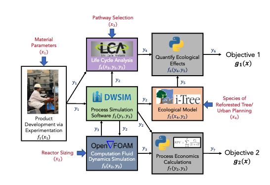
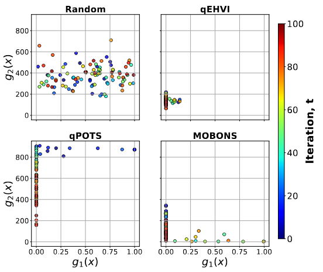
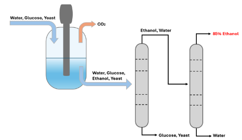

# MOBONS: A Network-Based Approach to Multi-Objective Optimization

*Illustration of a complex network system integrating process simulation, CFD, life cycle analysis (LCA), ecological modeling, and economic evaluation.*

## Overview
Designing modern industrial systems requires balancing competing objectives such as **profitability, resilience, and sustainability**, while accounting for complex **technological, economic, and environmental** interactions. Multi-objective optimization (MOO) methods help navigate these trade-offs, but selecting an appropriate solver is challenging, especially when system representations vary from **white-box (equation-based)** to **black-box (data-driven)** models.

**MOBONS** is a novel **Bayesian optimization-inspired algorithm** that unifies **grey-box MOO** through **network representations**, enabling flexible modeling of interconnected systems. Unlike traditional approaches, MOBONS:
- Supports **cyclic dependencies**, allowing feedback loops, recycle streams, and multi-scale simulations.
- **Incorporates constraints** while maintaining the sample efficiency of Bayesian optimization.
- Enables **parallel evaluations** to improve convergence speed.
- Leverages **network structure** for **scalability** beyond conventional MOO solvers.

## Case Studies
MOBONS is demonstrated on two case studies:

### 1. Synthetic ZDT4 Benchmark

A widely used synthetic benchmark for testing MOO algorithms. MOBONS effectively optimizes **discontinuous, multi-modal landscapes** where traditional solvers struggle.

### 2. Sustainable Ethanol Production

This case models **bioethanol production** by integrating **process simulation, economic evaluation, and life cycle analysis** to optimize sustainability metrics. MOBONS outperforms conventional solvers by efficiently handling **interdependent process models and dynamic trade-offs**.

## Baseline Comparisons
MOBONS is compared against four established MOO algorithms, demonstrating superior performance in **scalability, constraint handling, and convergence speed**.

## Citation
If you use MOBONS in your work, please cite our chapter. More details can be found in our full publication.

---
For further details, please refer to the documentation or contact us!

